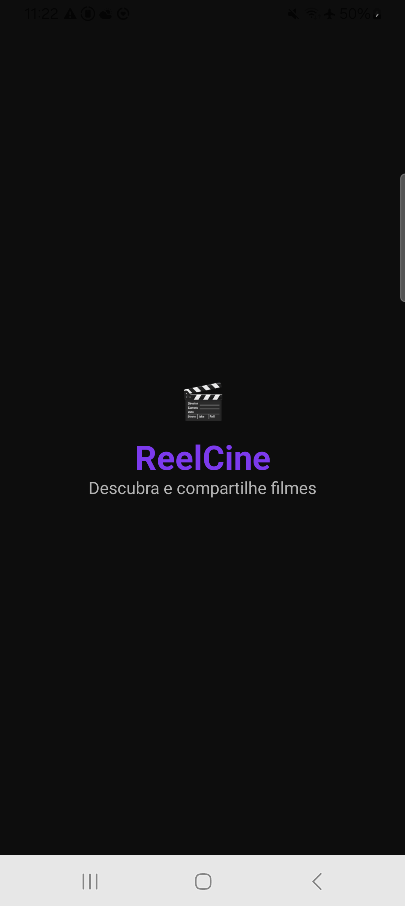
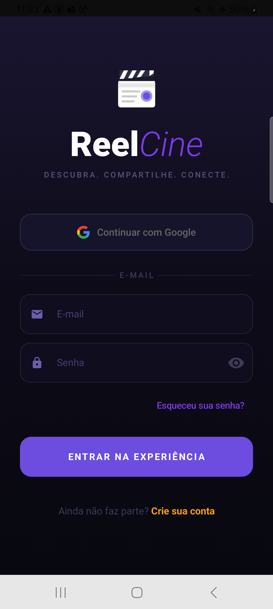
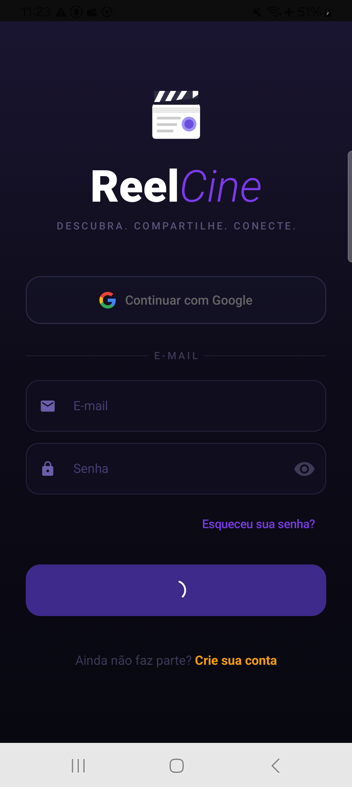
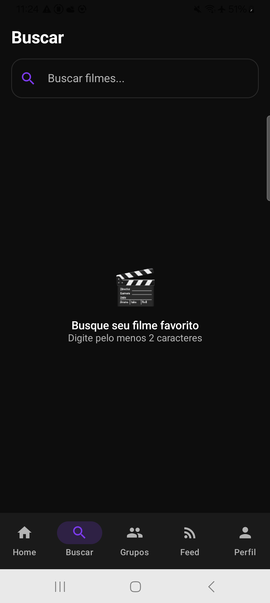
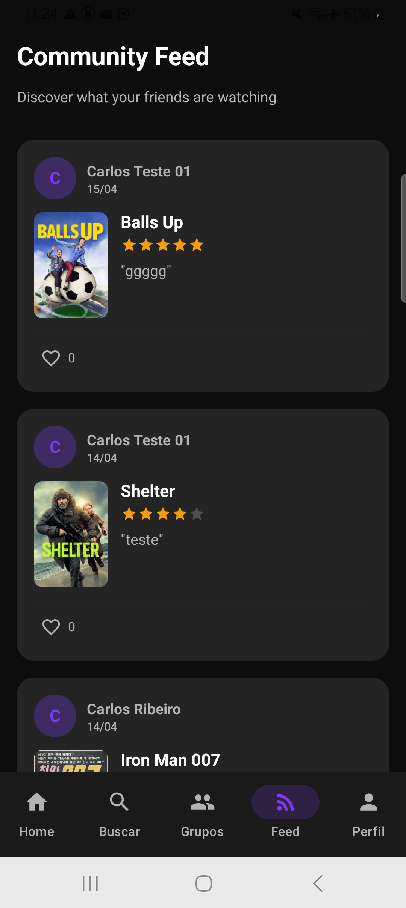
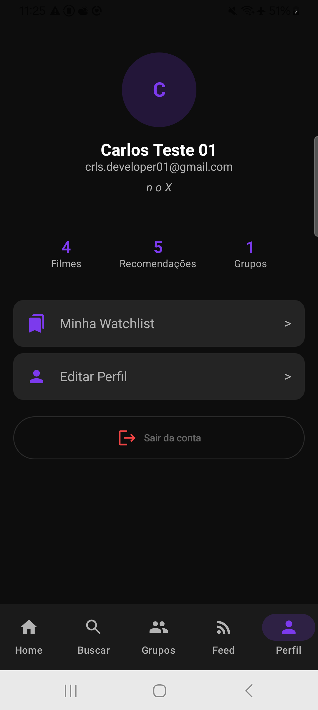

# 🎬 ReelCine

> **Discover. Share. Connect.**
> A social app for movie lovers — discover films, share recommendations and connect with friends through private groups.

## 📱 About

ReelCine is a native Android app built with **Jetpack Compose** and modern architecture. It consumes the TMDB API to display real-time movie data and uses Firebase as a full backend for authentication, database and storage.

## ✨ Features

- 🔐 **Authentication** — Email/password login and Google Sign-In
- 🏠 **Home** — Trending, now playing, upcoming and popular movies
- 🔍 **Search** — Real-time movie search
- 🎬 **Movie Detail** — Full info, trailer and ratings
- 📌 **Watchlist** — Save movies to watch later
- 👥 **Groups** — Create private groups and share recommendations
- 📢 **Feed** — See recommendations from all users
- 👤 **Profile** — Edit name, bio and profile picture
- 🌙 **Dark Mode** — Fully adapted dark UI

## 🏗️ Architecture

The project follows **Clean Architecture** principles with clear layer separation:
app/
├── data/
│   ├── remote/          # Retrofit, DTOs, API services
│   └── repository/      # Repository implementations
├── domain/
│   ├── model/           # Domain entities
│   ├── repository/      # Repository interfaces
│   └── usecase/         # Use cases
└── presentation/
├── navigation/      # NavGraph, Screen routes
├── screens/         # Screens + ViewModels
└── theme/           # MaterialTheme, colors, typography

## 🛠️ Tech Stack

| Category | Technology |
|-----------|-----------|
| UI | Jetpack Compose + Material 3 |
| Architecture | MVVM + Clean Architecture |
| DI | Hilt 2.56.1 |
| Navigation | Navigation Compose |
| Async | Kotlin Coroutines + Flow |
| Network | Retrofit + OkHttp |
| Images | Coil |
| Auth | Firebase Authentication |
| Database | Firebase Firestore |
| Movie API | TMDB API |
| Tests | JUnit4 + MockK |
| CI/CD | GitHub Actions |
| Language | Kotlin 2.0.21 |
| Min SDK | 26 (Android 8.0) |
| Target SDK | 36 |

## 🚀 Getting Started

1. Clone the repository:
```bash
git clone https://github.com/crlsribeiro/reelcine-android.git
```

2. Create the `local.properties` file at the root:
```properties
sdk.dir=/path/to/your/android/sdk
TMDB_API_KEY=your_api_key_here
```

3. Add your `google-services.json` to `app/`

4. Run:
```bash
./gradlew installDebug
```

## 🧪 Tests

```bash
./gradlew test
```

## 📸 Screenshots

| Splash | Login | Home |
|--------|-------|------|
|  |  |  |

| Movies | Search | Profile |
|--------|--------|---------|
|  |  |  |

## 👨‍💻 Author

**Carlos Ribeiro**
[](https://github.com/crlsribeiro)
[](https://linkedin.com/in/crlsribeiro-android-developer)

